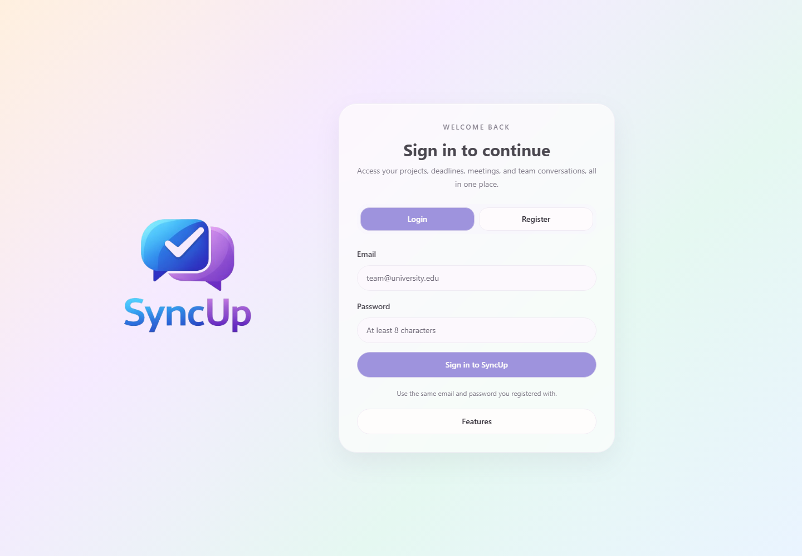
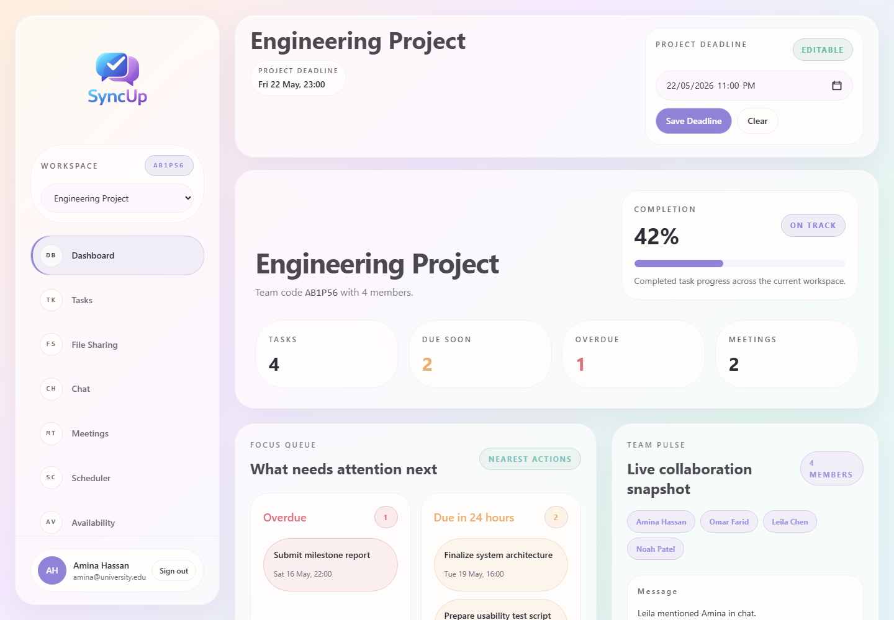
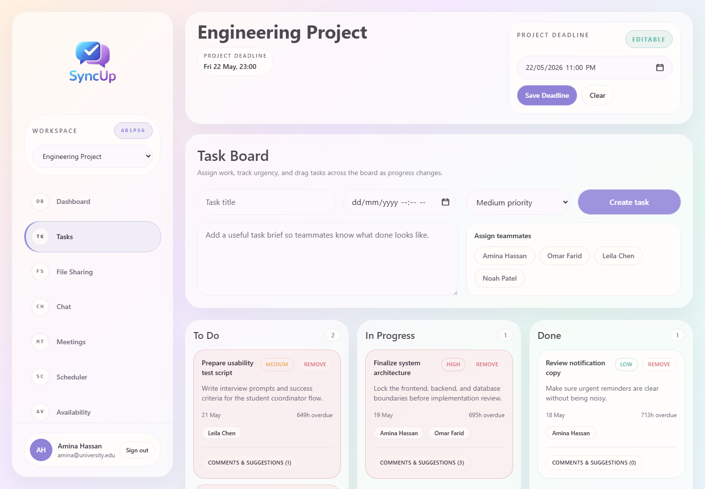
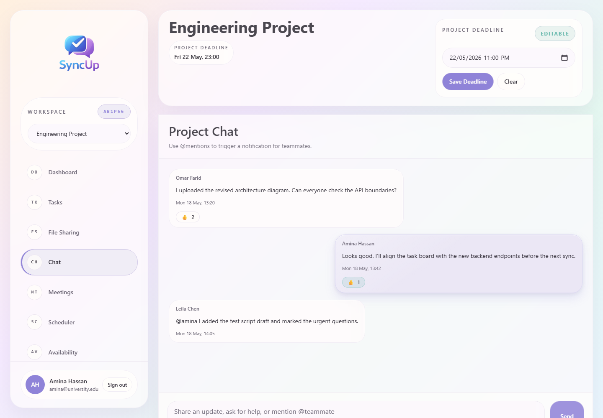
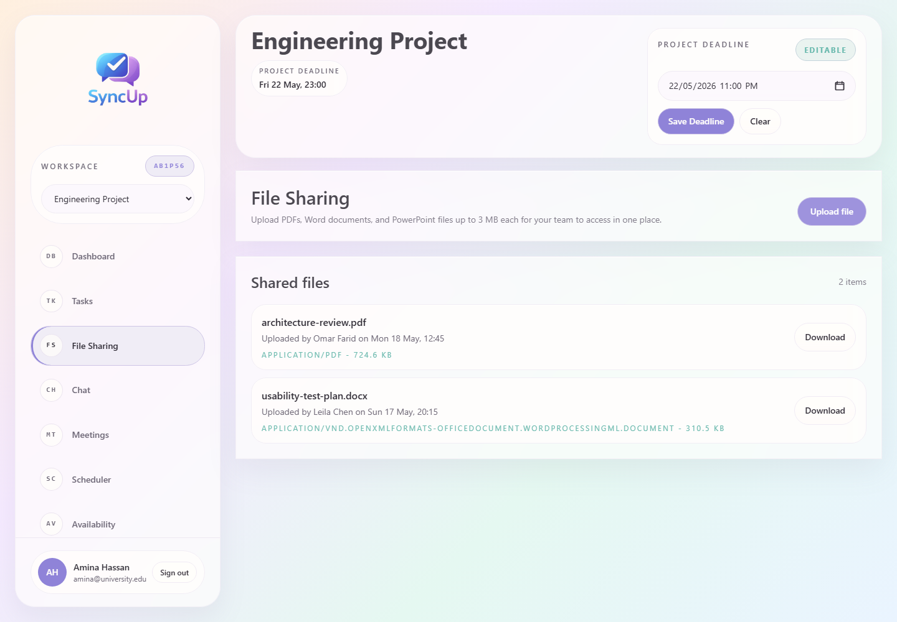
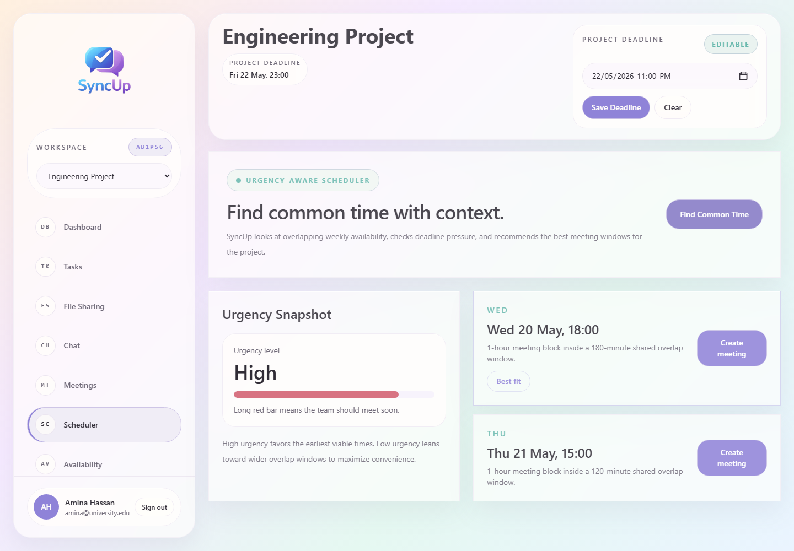

# SyncUp

SyncUp is a desktop application for student team coordination. It combines project management, multi-user task assignment, a weekly availability planner, urgency-aware meeting recommendations, project chat, file sharing, and notifications inside an Electron desktop shell.

## Screenshots

### Authentication



### Dashboard



### Task Board



### Project Chat



### File Sharing



### Urgency-Aware Scheduler



## Stack

- Electron desktop shell
- React + TypeScript + Tailwind CSS frontend
- Express + TypeScript backend
- Prisma ORM with MySQL
- Zustand state management

## Project Structure

- `frontend/` React renderer app
- `backend/` Express API and business logic
- `electron/` Electron main and preload processes
- `database/prisma/` Prisma schema

## Setup

1. Install Node.js 20+ and MySQL 8+.
2. Copy `.env.example` to `.env` and update the database credentials.
3. Install dependencies from the repo root:

```bash
npm install
```

4. Generate the Prisma client and migrate the database:

```bash
npm run prisma:generate
npm run prisma:migrate
```

5. Start the desktop app in development:

```bash
npm run dev
```

## Production Build

```bash
npm run package
```

The packaged Windows installer is emitted to `release/`.
